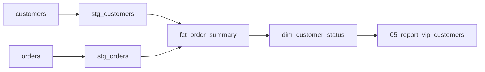

# sql_lineage_to_mermaid

SQLファイル群を静的解析し、テーブル/クエリ間の依存関係をMermaidのグラフ(Markdown形式)として出力するツール。

## 概要

- 対象ディレクトリ内の `*.sql` を1ファイルずつ [sqlglot](https://github.com/tobymao/sqlglot) でパースする
- `CREATE TABLE` / `CREATE OR REPLACE TABLE` / `INSERT INTO` / `MERGE INTO` のいずれかから出力先テーブルを特定する
- クエリ内で参照している全テーブルを参照元(依存元)として抽出する
- CTE(`WITH`句で定義した一時テーブル)は依存関係のノードから除外する
- 出力先が特定できないファイル(`SELECT`のみ等)は、ファイル名をノード名として扱う

### 既知の制約

- テーブル名はスキーマ修飾を無視して末尾の識別子だけで比較される。そのため `raw.orders` と `staging.orders` のように**異なるスキーマの同名テーブルは同一ノードとして統合**される
- 1ファイル = 1クエリ(1テーブルの定義)を想定しているため、1ファイル内で複数テーブルへの書き込みがある場合は最後に見つかった出力先のみが採用される

## 使い方

```bash
pip install sqlglot
python3 main.py <SQLファイルが入ったディレクトリ> [--dialect bigquery] > lineage.md
```

- `--dialect` は[sqlglot](https://github.com/tobymao/sqlglot)が対応する方言を指定する(デフォルト: `bigquery`)。指定できる方言はsqlglotのバージョンに依存するため、正確な一覧は以下で確認できる

  ```bash
  python3 -c "from sqlglot.dialects.dialect import Dialects; print(', '.join(sorted(d.value for d in Dialects)))"
  ```

  現在インストールされているバージョン(sqlglot 30.19.0)では次の方言が使える:
  `athena`, `bigquery`, `clickhouse`, `databricks`, `dax`, `doris`, `dremio`, `drill`, `druid`, `duckdb`, `dune`, `exasol`, `fabric`, `hive`, `materialize`, `mysql`, `oracle`, `postgres`, `presto`, `prql`, `redshift`, `risingwave`, `snowflake`, `solr`, `spark`, `spark2`, `sqlite`, `starrocks`, `tableau`, `teradata`, `trino`, `tsql`
- 出力はMarkdownの ```` ```mermaid ```` コードブロックとして標準出力に書き出される。VSCodeなら生成した`.md`ファイルを開いて `⇧⌘V` でプレビューできる
- パースに失敗したファイルは標準エラーに警告を出しつつ、他のファイルの処理は継続する

## サンプル

`sample_sql/` に5つのSQLファイルを用意している。それぞれ異なる抽出パターンを示す。

| ファイル | パターン |
|---|---|
| [sample_sql/01_stg_orders.sql](sample_sql/01_stg_orders.sql) | `CREATE OR REPLACE TABLE` |
| [sample_sql/02_stg_customers.sql](sample_sql/02_stg_customers.sql) | `CREATE TABLE` |
| [sample_sql/03_fct_order_summary.sql](sample_sql/03_fct_order_summary.sql) | `INSERT INTO` + CTE(CTEはノードから除外される) |
| [sample_sql/04_dim_customer_status.sql](sample_sql/04_dim_customer_status.sql) | `MERGE INTO` + サブクエリ |
| [sample_sql/05_report_vip_customers.sql](sample_sql/05_report_vip_customers.sql) | 出力先なし(`SELECT`のみ、ファイル名をノードとして採用) |

実行:

```bash
python3 main.py sample_sql --dialect bigquery > lineage.md
```

生成される [lineage.md](lineage.md) の中身:


