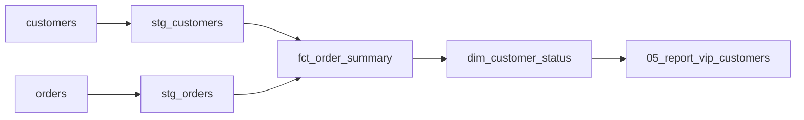

```mermaid
graph LR
    customers["customers"]
    stg_customers["stg_customers"]
    dim_customer_status["dim_customer_status"]
    05_report_vip_customers["05_report_vip_customers"]
    fct_order_summary["fct_order_summary"]
    orders["orders"]
    stg_orders["stg_orders"]
    customers --> stg_customers
    dim_customer_status --> 05_report_vip_customers
    fct_order_summary --> dim_customer_status
    orders --> stg_orders
    stg_customers --> fct_order_summary
    stg_orders --> fct_order_summary
```
